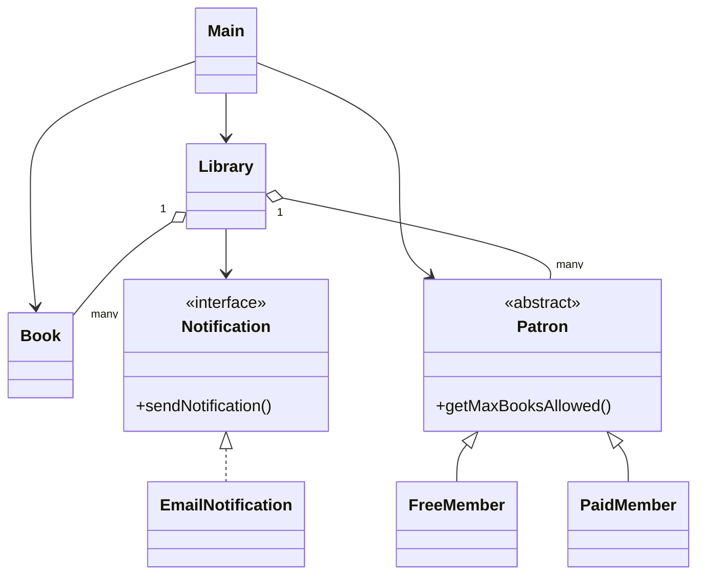

# Library Management System (LMS)

A simple Java-based Library Management System that demonstrates object-oriented design and SOLID principles.

## Features

- Add, update, and remove books from the library
- Register patrons as Free or Paid members
- Issue and return books with borrowing limits based on patron type
- Notification system for book availability (via interface)
- Track borrowing history for each patron

## Class Relationships

- **Book**: Represents information about a book (title, author, ISBN, publication year).
- **Patron**: Abstract class representing a library member.
    - **FreeMember** and **PaidMember** extend **Patron**, each with its own book borrowing limits.
- **Library**: Library class managing books, patrons, borrowing/returning books, and notifications.
- **Notification**: Interface for notification services.
    - **EmailNotification** implements **Notification** to send email notifications (other notification types can be added).
- **Main**: Contains the program’s entry point and demonstrates system usage.

### Class Diagram

